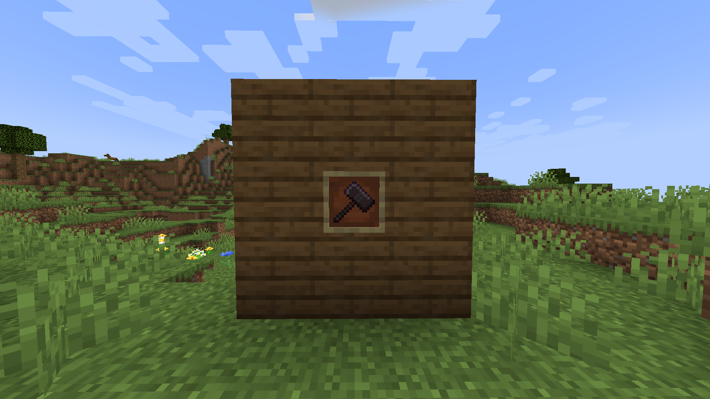
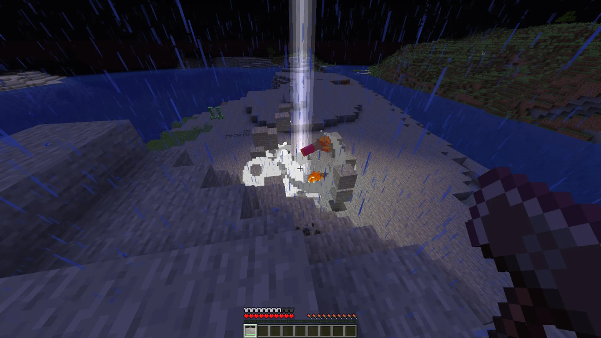
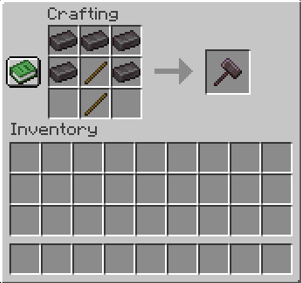

# Thunder Hammer Mod

## Περιγραφή
Το **Thunder Hammer** είναι ένα Forge mod για το Minecraft, το οποίο προσθέτει ένα ισχυρό σφυρί (**Thunder Hammer**) με τη δυνατότητα να προκαλεί κεραυνούς και να κάνει έκρηξη στην περιοχή που χτυπά.

---

## Χαρακτηριστικά
1. **Πρόκληση Κεραυνού**: Όταν ο παίκτης χρησιμοποιεί το Thunder Hammer, χτυπάει κεραυνός στον στόχο (μπλοκ ή οντότητα) προκαλώντας έκρηξη η οποία επηρεάζει την γύρω περιοχή.  
2. **Αλλαγή Καιρού**: Ενεργοποιεί αυτόματα θύελλα (thunderstorm) για πιο δραματική ατμόσφαιρα.  
3. **Cooldown & Διαθεσιμότητα**: Το σφυρί έχει συγκεκριμένο χρόνο φόρτισης (cooldown) και περιορισμένη αντοχή (durability).

---

## Media

*Thunder Hammer Texture*

*Thunder Hammer εν δράσει*

https://github.com/user-attachments/assets/01683ad2-dc0e-4b1f-8af0-43a376691ed3

---

## Τεχνικές Λεπτομέρειες Υλοποίησης
- Υλοποιείται ως custom αντικείμενο που επεκτείνει την κλάση `Item`.
- Γίνεται χρήση της κλάσης `LightningBolt` για την εμφάνιση κεραυνών στο σημείο πρόσκρουσης.
- Δημιουργείται έκρηξη και εκτόξευση των μπλοκ μέσω της κλάσης `FallingBlockEntity`.
- Η αντοχή (durability) και ο χρόνος φόρτισης (cooldown) διαχειρίζονται από το Forge.

---

## Οδηγίες Εγκατάστασης
1. **Κατεβάστε** το [Forge](https://files.minecraftforge.net/) για την αντίστοιχη έκδοση του Minecraft.  
2. **Ανοίξτε** τον φάκελο του Minecraft (συνήθως `%appdata%/.minecraft` σε Windows).  
3. **Τοποθετήστε** το αρχείο JAR του mod στον φάκελο `mods/`.  
4. **Εκκινήστε** το Minecraft μέσω του Forge Profile.

---

## Τρόπος Χρήσης
1. **Crafting**:  
   
2. **Έξτρα Λεπτομέρειες**:  
   - Με το **δεξί κλικ** προκαλείται κεραυνός στο σημείο που στοχεύετε.  
   - Επιπρόσθετα, προκαλείται έκρηξη και εκτίναξη των γύρω μπλοκ.  
   - Υπάρχει **cooldown** μεταξύ των χρήσεων και περιορισμένη αντοχή.

---

## Τρόπος Δοκιμής
1. **Κατεβάστε ή κλωνοποιήστε** αυτό το αποθετήριο.  
2. **Ανοίξτε** το project σε IDE που υποστηρίζει Gradle.  
3. **Τρέξτε** την εντολή `gradlew build` (ή `./gradlew build`) για δημιουργία του τελικού JAR.  
4. **Μεταφέρετε** το [JAR](https://github.com/GiannisBab/Forge-ThunderHammer-1.21.X/blob/master/thunderhammer-0.01.jar) στον φάκελο `mods`.  
5. **Εκκινήστε** το παιχνίδι και δοκιμάστε το Thunder Hammer είτε φτιάχνοντας το στο survival mode είτε αναζητώντας το στο search bar του creative mode.

---

## Προτάσεις Συνεισφοράς
- Δημιουργήστε **issues** για αναφορές σφαλμάτων ή νέα χαρακτηριστικά.  
- Κάντε **fork** το αποθετήριο, εργαστείτε σε νέο branch και υποβάλετε **pull request**.  
- Ακόμη, δεχόμαστε βελτιώσεις σε μεταφράσεις ή μικρο-βελτιστοποιήσεις κώδικα.

---

## Άδεια Χρήσης
Αυτό το έργο διαθέτει άδεια χρήσης σύμφωνα με τους όρους της [Creative Commons Attribution-NonCommercial 4.0 International License](http://creativecommons.org/licenses/by-nc/4.0/).

---
